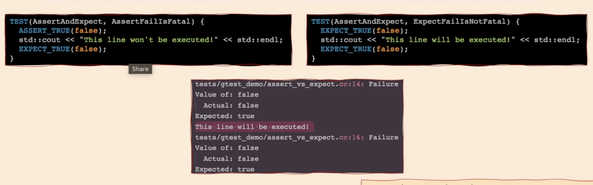
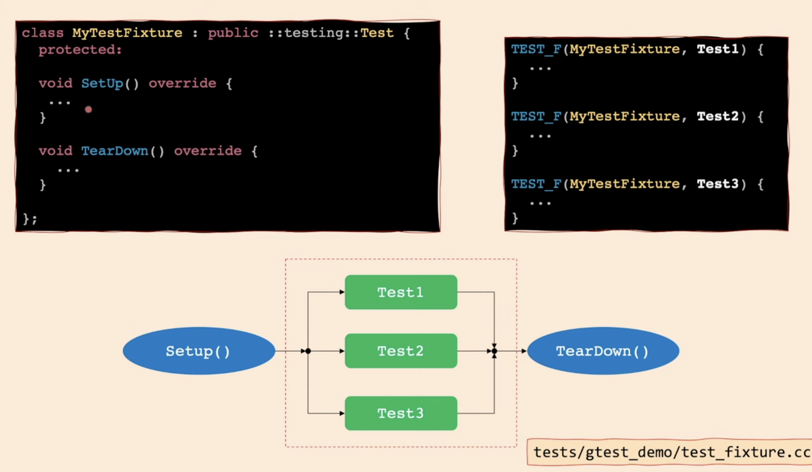
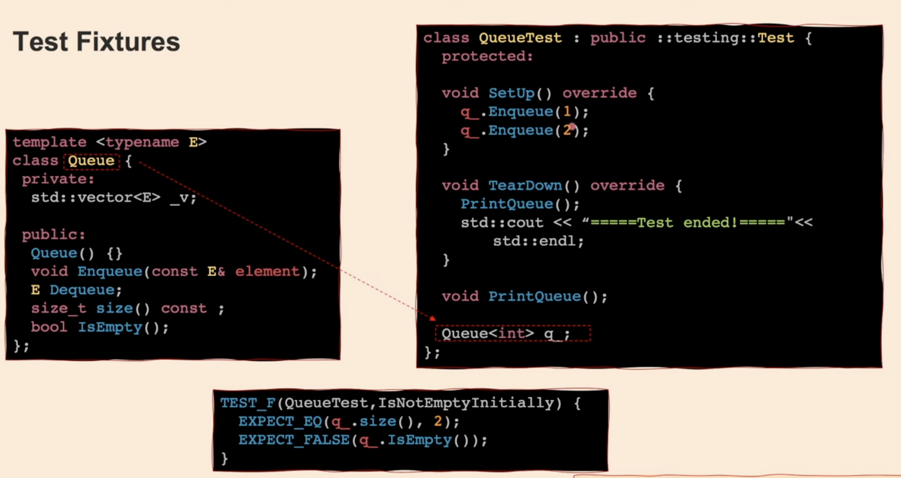
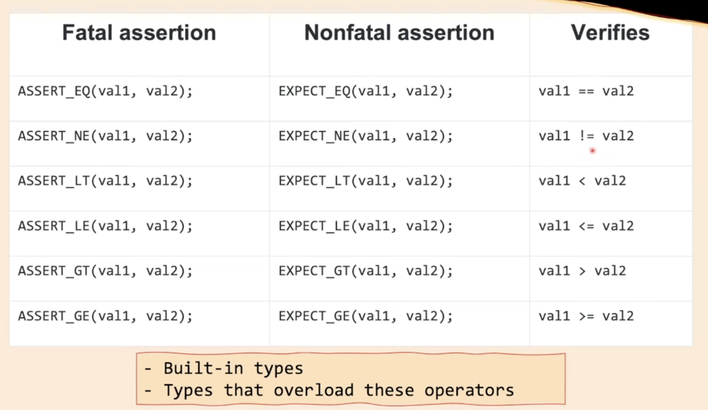
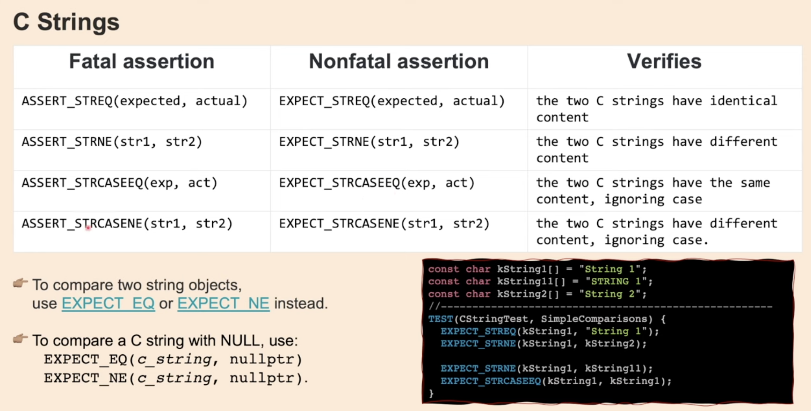
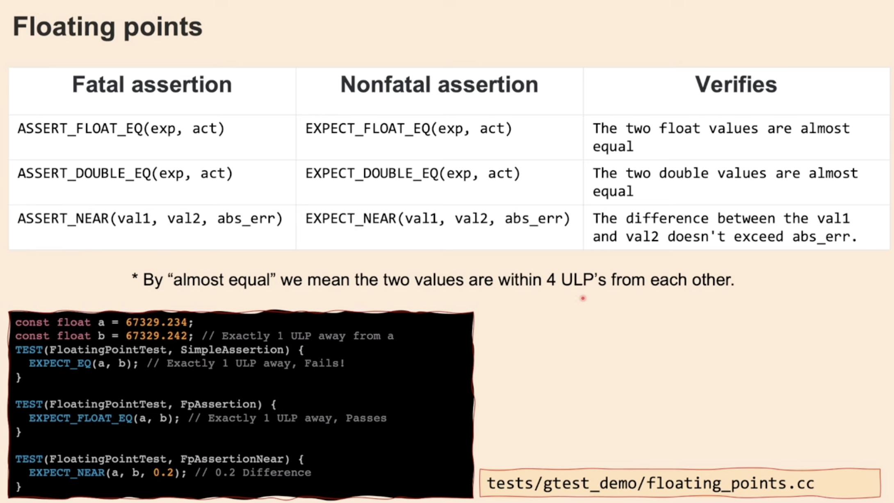
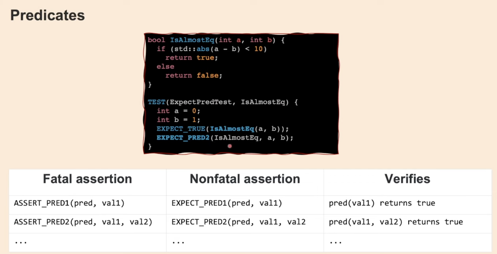
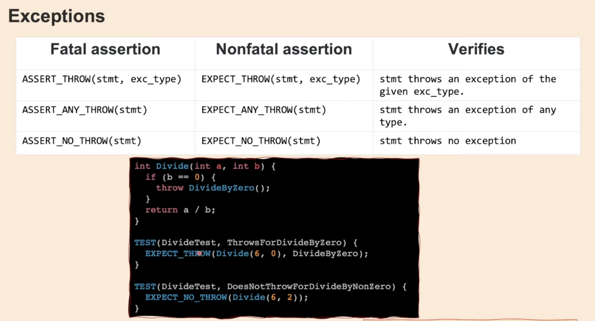

## Testing
### 1. Lowest level: Unit tests
- Unit tests are for each methods and functions in our code
- This is to make sure every line of code works 
- Code coverage: 100% code coverage ussually refer to 100% line of code coverage

### 2. Component testing: 
- This tests the whole component of a software

## Unit tests using Google Test
## 1. Google Test Assertion Macros
- Fatal assertion: When this test fail, the code below it will not be executed.
    * ASSERT_TRUE(condition): Verifies condition is true
    * ASSERT_FALSE(condition): Verifies condition is false

- Nonfatal assertion: When this test fail, the code below it will execute.
  * EXPECT_TRUE(condition): Verifies condition is true
  * EXPECT_FALSE(condition): Verifies condition is false

## 2. Test Fixtures

### Steps to set up test fixture: 
Step 1: Create a class that is extends ::testing::Test{} class
Step 2: Write code in the SetUp() and the TearDown Function
Step 3: Write the tests using TEST_F

### Example of testing the queue class: 

In `SetUp()` function, we set up the queue so it has two values 1 and 2. Tests can be written with out having to write the set up again for each test.

## Resources: All Macros

### Table of Binary Comparison Assertions

### For C Strings

NOTE: This is only for C Strings. When using std::string, it's better to use the Binary Comparison Assertions version

### For Floating Points

### Predicates

### Exceptions
